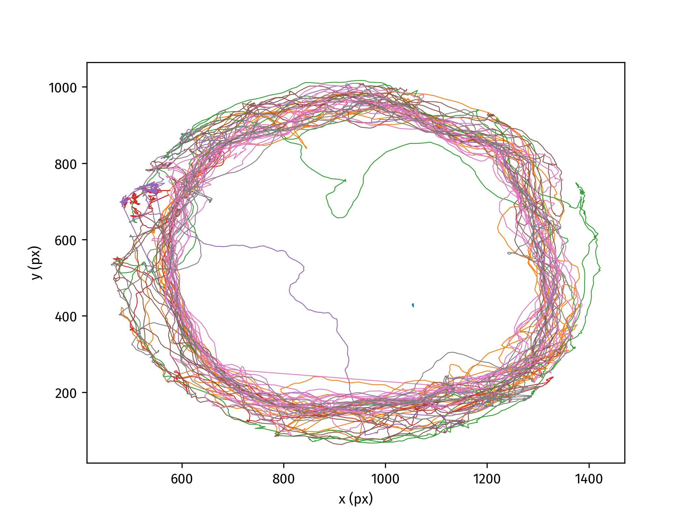

# TracktorLive Tutorial 2: Tracking objects

In this tutorial, you will learn how to track 8 termites in a pre-recorded video
using the command-line utility (i.e., without writing any python code.) The
folder for this tutorial contains a file named `masked_termite_video.mp4`, in
which you can see 8 termites in a Petri dish. We have also provided a file,
`termite-params.json`, which contains perfectly tuned parameters for tracking
termites in this specific video. For this tutorial, we will directly use these
parameter values, but in the next tutorial, you will learn how to select
those values for your own videos and organisms. You may also notice that the
background outside the Petri dish has been masked (appears black) in the video
accompanying this tutorial. This was
also done with TracktorLive, using the [Add Circular
Mask](../../Library_Of_Casettes/Add_Circular_Mask/add_circular_mask.md)
cassette (but we will get to this later!).



## Goal

To track all 8 animals in an arena using a single command, and produce a .csv
file containing their trajectories. 

## Method

We will once again use the command-line utility, `tracktorlive`, to do this. The
utility works well for simple use-cases like this one, without much background
disturbance or lighting issues. More complex cases will require writing code
and incorporating appropriate cassettes from the [Library of
Casettes](../../Library_Of_Casettes/).

The command we will run is:

```bash
tracktorlive track --file masked_termite_video.mp4 --numtrack 8 --write-rec termite-params.json
```

The .csv file with trajectories of all 8 individuals will appear in a newly generated folder. 
The resulting tracks have been visualised above.

### Explanation

The following table explains the different arguments of the command line we are using.

| Argument | Value | Description |
|----------|-------|-------------|
| `track` | NA | Subcommand to start a tracking server. |
| `--file` | `masked_termite_video.mp4` | Path to the input video file. |
| `--numtrack` | `8` | Number of individuals to track simultaneously. |
| `--write-rec` | NA | Save tracking results to a CSV file. |
| NA | `termite-params.json` | JSON parameter file containing tracking settings (positional argument). |

The final and most important argument should always be your tracking information
contained in a json file. Open the file to see the format in which those
tracking parameters are stored.

If you also add the argument `--show-display`, `tracktorlive` will show you the
highlighted positions of all termites as it is tracking them. 

### Use-case

If you have numerous videos recorded using the same experimental setup, this
command line can be used to track them all. With some knowledge of shell
scripting, you might use a shell for-loop to apply this command to multiple
video files without having to write the command each time.

