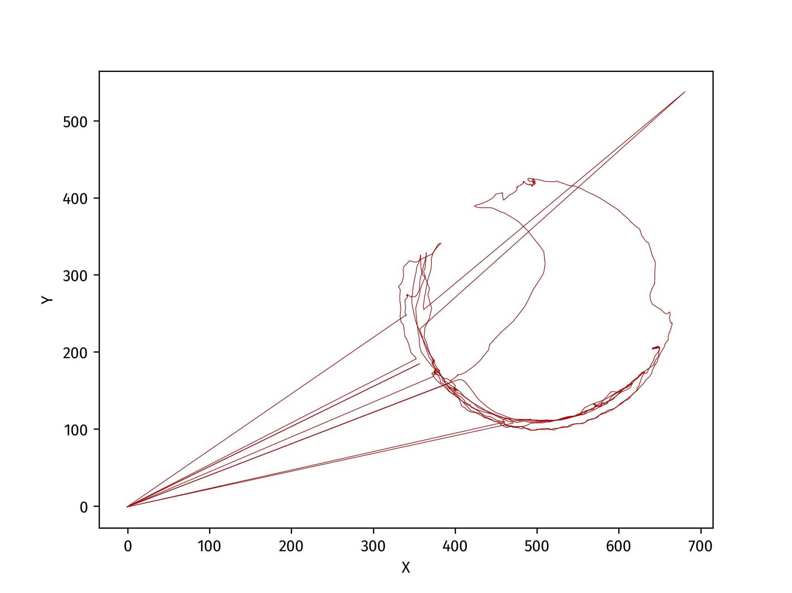

# TracktorLive Tutorial 3: Tuning tracking parameters

Under the hood, TracktorLive runs
[Tracktor](https://doi.org/10.1111/2041-210X.13166)
which uses conventional (non-machine-learning) approaches to track the positions
of objects in a video. To perform tracking, Tracktor needs certain
parameter values. Fortunately, TracktorLive comes with a helpful GUI to tune these parameter
values so that tracking can be achieved with minimal guesswork.

## Goal

To generate a .json file containing tracking parameter values and use these
values to track the position of an ant in a pre-recorded video. The folder for
this tutorial contains a video, `ant.mp4`, showing the movement of an
individual ant in a petri dish.

## Method

### Obtaining tracking values

`tracktorlive gui` is the subcommand to obtain and tine parameter values for
tracking. This is the full command you need to type into the terminal:

```bash
tracktorlive gui --file ant.mp4 --out ant-params.json
```

The `--out <filename.json>` argument specifies where to store the tuned tracking
parameters.

Once you run the command, you will see several parameters with values you can
adjust using sliders, and a dynamic display showing the 'contours' of objects
seen by Tracktor based on the current tracking parameters.

Tracktor uses adaptive thresholding to detect focal objects in each video frame.
The principle is as follows: take an image, transform it into grayscale, and
assign all pixels with pixel intensity above a given threshold value to white
and pixels with intensity below this value to black. [‘Adaptive thresholding’](https://docs.opencv.org/4.x/d7/d4d/tutorial_py_thresholding.html)
goes one step further to dynamically adjust the threshold. Instead of using
a fixed threshold value for the entire image, adaptive thresholding calculates
this value locally since illumination is likely to be more even at smaller
spatial scales. This is achieved by taking the mean pixel intensity within
a given neighbourhood (the **block_size** parameter) and adjusting this value by
subtracting an offset (the **offset** parameter).

**block_size**: Neighbourhood size where local pixel intensity is calculated

**offset**: A shift in the threshold value relative to the neighbourhood mean

**min_area**: Minimum area (in pixels) occupied by the object of interest

**max_area**: Maximum area (in pixels) occupied by the object of interest

Additionally, the gui also has an **invert** parameter which you can toggle
depending on the illumination in your experimental arena. If your object of
interest is dark on a light background, leave this parameter in its default
state 1. If your object of interest is light on a dark background, then toggle
this to set it to 0. Finally, the TracktorLive GUI also allows the user to pause
the video (whether recorded or live from a web-cam) and adjust parameters to
optimize for specific frames in the video. To pause or resume, press `<Space>`. 

Change the parameters using the sliders so the ‘contours’ of the objects are
delineated in red and stable through time. Once the contours appear stable, press the `<Esc>` key to
save parameter values and exit. You can compare the values you arrive at to the
ones we determined for demonstration purposes, which you can find in the file
`supplied-params.json`.

### Tracking the ant

As in [Tutorial 2](../02-tracking-objects/), we will use the `tracktorlive
track` subcommand to track the position of the ant. For this, run:

```bash
tracktorlive track --file ant.mp4 --write-rec ant-params.json
```

### Explanation



As you can see. the ant's location has been accurately tracked (see plot above)
most of the time. When TracktorLive cannot detect the position of the ant, it
indicated this with the special coordinates (x = -1.0, y = -1.0) as the 'unknown' location.
In your analyses, you
should drop (or otherwise appropriately handle) these values. Further, at one
point, the ant was mistakenly detected in the top right corner of the frame,
outside the Petri dish. Such cases can be avoided by either (a) better tuning
the tracking parameters, or (b) by applying appropriate casettes to minimise
error potential. In the next tutorial, we will explore the tracking of the same
video with the application of such casettes.


## CLI Documentation

With this tutorial, we have gone over all the important uses of the
`tracktorlive` command-line utility. To see all its subcommands, and
explanations of all its arguments, see the [API style
reference](../../DOCS/07-reference.md).
