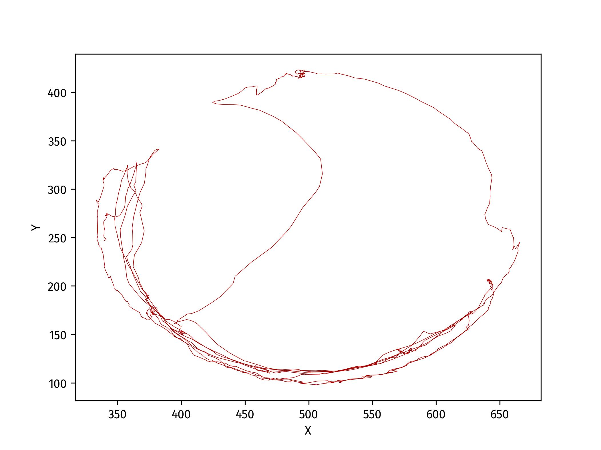
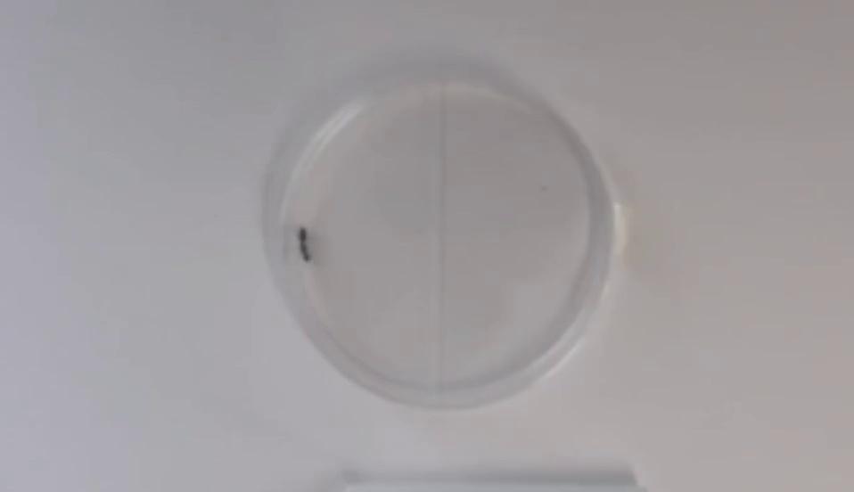
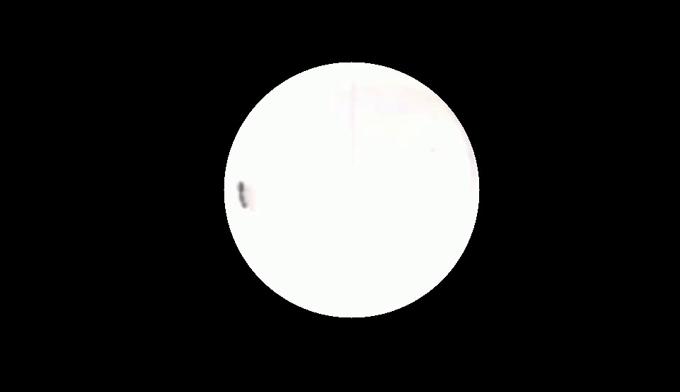

# TracktorLive Tutorial 4: Tracking in a complex situation

In the last tutorial, we used `tracktorlive gui` to tune computer vision
parameters to track the location of an ant in a Petri plate. However, we saw
that the predicted location was erroneous in several locations. While the
tracking can be improved by better tuning of parameters and better lighting, in
the course of scientific lab experiments involving animals one is inevitably
faced with situations where the base video is not optimal for tracking. Here, we
will use the TracktorLive python library along with some pre-recorded cassettes
to improve the tracking of the ant from the last tutorial.


## Goal

In this folder is a video, `ant.mp4`, showing the movement of an individual ant
in a Petri dish.
You will first learn to apply available cassettes to make the video more
trackable. You will then generate another video with these videos applied. You
will then re-tune the tracking parameters, and use the new parameters to do
a proper final tracking of the ant.

## Method

Here is the set of steps we will follow:

1. We will use the
   [Extract Specified
   Frames](../../Library_Of_Casettes/Extract_Specified_Frames/extract_specified_frames.md)
   cassette to pull out a representative frame from the video as a JPEG
   file.

2. We will use this JPEG file to find the centre and radius of the Petri
   plate in the frame. We will then use the [Add Circular
   Mask](../../Library_Of_Casettes/Add_Circular_Mask/add_circular_mask.md)
   cassette and the
   [Boost
   Contrast](../../Library_Of_Casettes/Boost_Contrast/boost_contrast.md)
   cassettes to improve tracking efficiency.

3. We will re-tune the tracking parameter values using `tracktorlive gui`.

4. We will use the newly tuned parameters alongside the above mentioned
   cassettes to complete the ant tracking protocol.

As we step into using TracktorLive as a python library rather than as a command
line tool, please note that all python scripts running this library have the
following effective format.

```python
import json
import tracktorlive as trl

with open("params.json") as jsonf:
    params = json.load(jsonf)
FEED_ID = "trial-feed"

server, semm = trl.spawn_trserver(0, params, feed_id=FEED_ID)

# SERVER CASETTES WILL GO HERE
# THOSE WILL TAKE CARE OF VIDEO PROCESSING ETC

client = trl.spawn_trclient(feed_id=FEED_ID) #optional

# OPTIONALLY:
# CLIENT CASETTES WILL GO HERE
# THOSE WILL TAKE CARE OF RESPONSE DELIVERY

trl.run_trsession(server, semm, client)
```

First, we will create a 'dummy' set of parameter files to begin using
TracktorLive with our video (see Tutorial 1). For this, type `tracktorlive gui
-f ant.mp4 -o dummy-params.json`  in your shell, tweak the parameter values
randomly, and press <Esc> to save.

Our final tracking system will apply cassettes to mask out every extraneous
detail outside the ant's Petri plate, and will increase the contrast in the
video.
Before that, we will create the file `pre_record.py`. This file will show us
what Tracktor will 'see' after such cassettes have been applied, and allow us to
tune our tracking values for this altered video stream. 
`dummy-params.json` is used to launch this Tracktor Server.
We have added the [Extract Specified
   Frames](../../Library_Of_Casettes/Extract_Specified_Frames/extract_specified_frames.md)
cassette to extract the 100th frame of the video. This will help us decide wthe
parameters for the [Add Circular
   Mask](../../Library_Of_Casettes/Add_Circular_Mask/add_circular_mask.md)
   cassette, so that disturbances outside the Petri plate do not interfere with
   tracking.
We have also used the
   [Boost
   Contrast](../../Library_Of_Casettes/Boost_Contrast/boost_contrast.md)
   cassette.
This file will generate another video in the pre_record_ant/ directory, which
you can play to see that details outside the Petri plate have been blacked out
and contrast has been boosted.

Rename the created video to 'masked_ant.mp4'. Then, we can use the command
`tracktorlive gui -f masked_ant.mp4 -o true-params.json` to accurately tune
the tracking parameters.

Finally, we have created the file `track.py`, that uses all cassettes used here
as well as the `write_recordings=True` option, to accurately track the ant.

### Explanation



The performance of our tracking system is generally much improved. This is
because our cassettes have clearly improved the 'visibility' of the ant and how
to distinguish it from background noise. See below, frames with and without our
cassettes:




