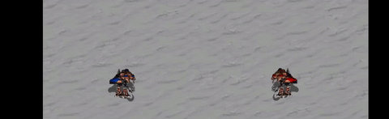

# TracktorLive Tutorial 7: Video chunking

-------------------------

# Disclaimer:
This example includes a video excerpt from StarCraft: Brood War (1998), developed and published by Blizzard Entertainment,
used here solely for academic, non-commercial demonstration purposes. All intellectual property rights to StarCraft remain with 
Blizzard Entertainment. No affiliation or endorsement is implied.

The footage is used under fair use provisions for research and educational display of proximity-based video chunking systems.

-------------------------

## Goal

Many times, we are recording pairs of animals to study particular behaviours.
For instance, you may record a pair of animals for 20 days but only care about
the three hours that they interact with each other. Or you may set up animals in
a holding area, but only care about the times they enter an experimental arena.
We need a system that can only record and save chunks of videos when interesting
things are happening.

Here, we have a video of a pair of ultralisks from the classic game Starcraft:
Brood War. 

https://github.com/user-attachments/assets/8b229e67-c04e-4395-9f08-17f52600fa53

Suppose we only care to detect these animals when they are less than 300px apart
from each other. 

## Method

We will use the [Record When Together])(Library_Of_Casettes/Record_When_Together/record_when_together.md) cassette to get this use,
where we can set the threshold proximity distance of animals for video recording
to begin. 

You can see that the below three chunks are automatically detected and extracted:

While we have done this with a video stream, it is easy to replicate with
a realtime feed by changing the declaration of the server. In the
trl.spawn_trserver segment, change the name of the video to the index of the
camera, and set `realtime` to False.
