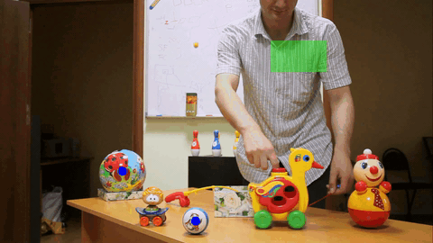

# TrackorLive Tutorial 9: TracktorLive using YOLO and ByteTrack

## Goal
To initiate a TracktorLive server that uses
[YOLO](https://docs.ultralytics.com/) and
[ByteTrack](https://docs.ultralytics.com/modes/track#bytetrack) for object
tracking in place of Tracktor.

While TracktorLive focusses on speed and uses Tracktor internally by default,
there might be times when a user might want to use a more advanced tracking
solution in combination with our cassette based real-time response system. For
this, TracktorLive v2.0 comes with a Bring-Your-Own-Tracker (BYOT) option. This
tutorial shows how to use a standard deep learning based object detection
framework for tracking.

## Pre-requisites

Install the necessary python libraries by running 

```bash
python -m pip install ultralytics
```

## Method

For using an external tracking solution, the only thing one needs to change is
to add the command line argument (`internal_tracking=False`). 


This disables not
only the running of Tracktor, but also the internal subtleties for writing
tracking data and clock information as well as the most recently captured frame
to their respecive buffers. It is crucial that users take over these
functionalities manually in the **last** server cassette declared.

As a demonstration, we have provided the demo script `tracking.py`, which tracks
a ball in the below complex object layout and triggers an action when the ball
is brought into the highlighted rectangle. To run the script, run

```bash
python tracking.py
```

Read the script and especially the YOLO_TRACKING_SINGLE_OBJECT cassette to see
how to run your own tracker in sync with TracktorLive.



Running the script, the ball can be tracked by YOLO within TracktorLive's
framework, and a cassette to change the highlight rectangle's colour as well as
one to draw an alert symbol are both invoked when the ball is brought into the
zone of interest.

## Use-cases

Disabling internal tracking and using a tracking software of one's own choice in
combination with TracktorLive is a powerful tool that can extend our real-time
capabilities to video feeds where Tracktor is too simple for tracking. With an
appropriate pre-training (".pt") file, the cassette provided here can be used in
combination with other cassettes to already more complex feeds such as traffic
videos or animals on complex backgrounds.

While we demonstrate here with YOLO, this method can also be used for embedding other trackers into 
TracktorLive as long as their APIs can be used within the TracktorLive
`_eachframe` loop. We encourage users to try their favourite trackers and submit
working cassettes to expand the capabilities of our software.
